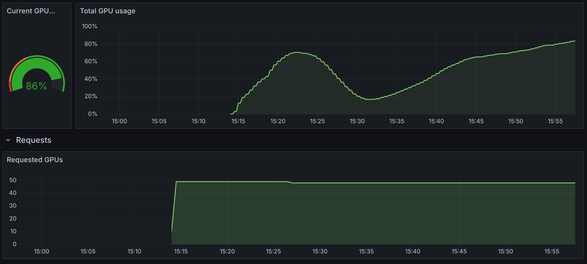

Get the client environment:

```bash
wget https://github.com/OpenFreeEnergy/alchemiscale.org-deployment/raw/refs/tags/2025.03.04-0/deployments/root/conda-envs/alchemiscale-client.yml
micromamba create -f alchemiscale-client.yml
```

## OpenFF alchemiscale compute service deployment

In `jobs.yaml`, adjust number of completions and degree of parallelism desired based roughly on number of `Task`s known to be `waiting`.

To create secret from settings file:

    kubectl create secret generic openff-alchemiscale-settings-yaml --from-file=settings.yaml

To create jobs deployment:

    kubectl apply -f jobs.yaml

To delete jobs deployment:

    kubectl delete jobs openff-alchemiscale-jobs

To delete settings secret:

    kubectl delete secret openff-alchemiscale-settings-yaml
    
## Monitoring utilisation

GPU utilisation for OpenFF namespace: <https://grafana.nrp-nautilus.io/d/dRG9q0Ymz/k8s-compute-resources-namespace-gpus?var-namespace=openforcefield&orgId=1&refresh=30s&from=now-1h&to=now&timezone=browser>

GPU utilisation for all of NRP: <https://grafana.nrp-nautilus.io/d/fHSeM5Lmk/k8s-compute-resources-cluster-gpus?orgId=1&from=now-24h&to=now&timezone=browser>

GPU utilisation will have a two-humped pattern:



The first hump is the vacuum simulation. The second hump is the solvent simulation. The valley between them is JAX computing stuff on the CPU:

```bash
$ kubectl logs jm-openff-alchemiscale-jobs-4-kkwv8 -f
<-- snip -->
******* JAX 64-bit mode is now on! *******
*     JAX is now set to 64-bit mode!     *
*   This MAY cause problems with other   *
*      uses of JAX in the same code.     *
******************************************

WARNING:2025-04-17 05:17:14,592:jax._src.xla_bridge:966: An NVIDIA GPU may be present on this machine, but a CUDA-enabled jaxlib is not installed. Falling back to cpu.
<-- snip -->
```
